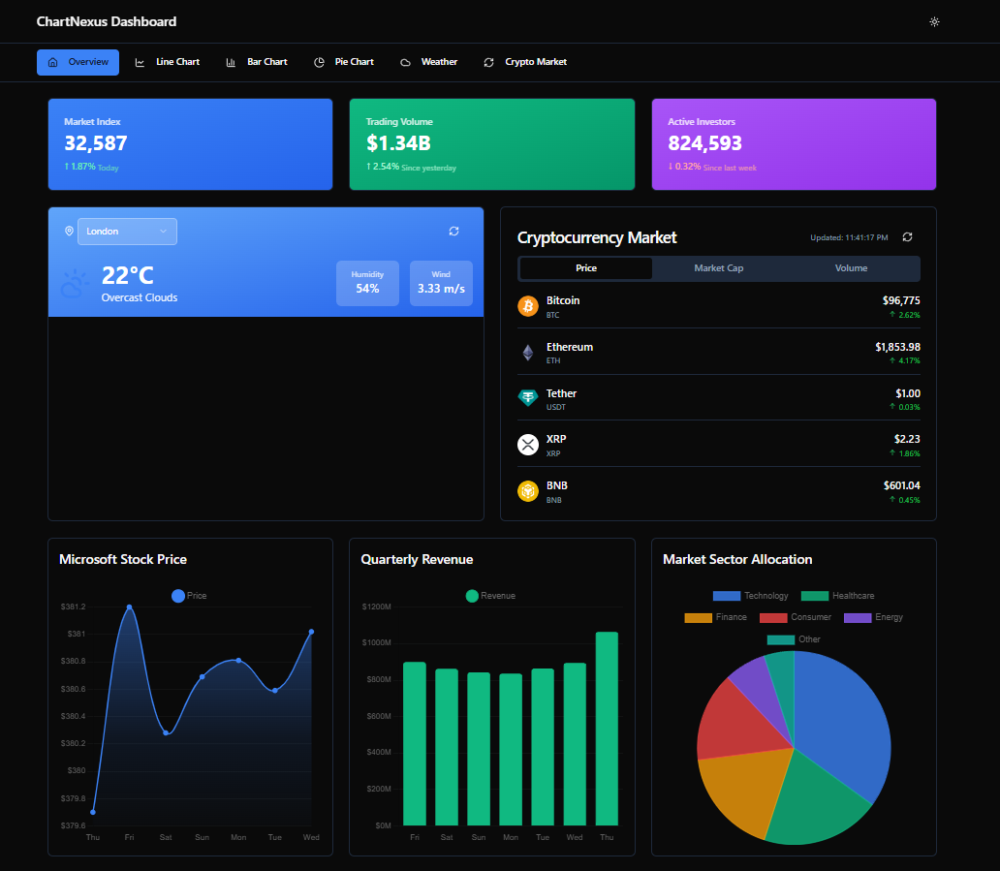

# 📊 ChartNexus Dashboard

A modern, responsive, and visually engaging analytics dashboard built with **React**, **Vite**, **Chart.js**, **Recharts**, and **ShadCN UI**. This dashboard displays dynamic data visualizations for market analytics, weather updates, cryptocurrency performance, stock prices, and revenue metrics.

---

## 🚀 Features

- 📈 **Interactive Charts** using Chart.js and Recharts  
- 🌐 **Weather Integration** (with location selector)  
- 🪙 **Live Cryptocurrency Market Prices**  
- 🧠 **ShadCN UI** + **Radix UI Primitives** for clean and accessible design  
- ⚡ Built on **Vite** for blazing fast performance  
- 🎨 Fully responsive & dark-mode optimized  

---

## 🛠️ Tech Stack

| Tool              | Purpose                                 |
|------------------|------------------------------------------|
| React 18          | UI Framework                             |
| Vite              | Frontend Build Tool                      |
| Chart.js 4        | Pie charts and advanced visualizations   |
| Recharts          | Line and bar charts                      |
| ShadCN + Radix UI | UI Components and Accessibility          |
| Tailwind CSS      | Utility-first CSS styling                |
| Lucide Icons      | Clean, lightweight icon set              |
| React Hook Form   | Form handling (if used for inputs)       |

---